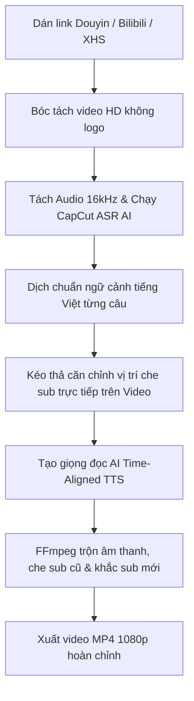

# ⚡ DUZKVIDEOTOOL (v3.1.0)
> **Nền Tảng AI Tự Động Hóa Bóc Tách Phụ Đề, Dịch Thuật & Lồng Tiếng Video Đa Kênh (Douyin · Bilibili · Xiaohongshu · TikTok)**

[](https://nodejs.org/)
[](https://react.dev/)
[](https://expressjs.com/)
[](LICENSE)

---

## 📖 Giới Thiệu (Overview)

**DUZKVIDEOTOOL** là bộ giải pháp công nghệ toàn diện giúp các nhà sáng tạo nội dung, affiliate marketer và nhà làm phim tự động hóa 100% quy trình:
1. **Tải & Bóc Tách Video HD Không Logo** từ các nền tảng video hàng đầu: Douyin (抖音), Bilibili (B站), Xiaohongshu (小红书), TikTok.
2. **Nhận Diện Giọng Nói Từng Phân Đoạn (CapCut ASR Engine):** Lắng nghe toàn bộ file âm thanh và bóc tách từng câu thoại (1.5s - 3.5s) chuẩn xác đến 0.1 giây.
3. **Dịch Thuật AI Chuẩn Ngữ Cảnh 100%:** Dịch sát nghĩa sang tiếng Việt tự nhiên, gãy gọn, ăn khớp nhịp điệu với nhân vật trong video gốc.
4. **Trình Căn Chỉnh Trực Tiếp Trên Video (Interactive On-Video Studio):** Kéo thả trực tiếp thanh che phụ đề tiếng Trung cũ trên video, xem trước phụ đề tiếng Việt chạy theo thời gian thực trước khi render.
5. **Lồng Tiếng AI Chuẩn Nhịp (Time-Aligned Neural TTS):** Thuật toán tự động co giãn tốc độ (`atempo`) và chèn khoảng lặng (`silence padding`) giúp giọng đọc tiếng Việt khớp 100% với hành động của video.
6. **Tiện Ích Chrome MV3 Đa Nền Tảng:** Tự động chèn thanh công cụ 1-Click tải video không logo và mở Studio lồng tiếng ngay trên trình duyệt.

---

## 🏗️ Cấu Trúc Dự Án (Project Structure)

```
DUZKVIDEOTOOL/
├── chrome-extension/            # Mã nguồn Chrome MV3 Extension (WXT + React)
│   ├── entrypoints/
│   │   ├── bilibili.content.ts  # Thanh công cụ & tải video trực tiếp trên Bilibili
│   │   ├── xiaohongshu.content.ts # Thanh công cụ & tải video/ảnh Xiaohongshu
│   │   ├── douyin-main.content.ts # Nhận diện & tải video Douyin
│   │   ├── sidepanel/           # Giao diện Sidepanel điều khiển đa kênh
│   │   └── background.ts        # Service worker xử lý tải ngầm
│   └── package.json
│
├── chrome-extension-build/      # Bản build sẵn sàng nạp trực tiếp vào Chrome
│   ├── manifest.json
│   └── ...
│
├── web-studio/                  # Ứng dụng Web Studio trung tâm
│   ├── client/                  # Frontend React 19 + Vite + Lucide Icons
│   │   ├── src/
│   │   │   ├── components/
│   │   │   │   ├── DubbingStudio.tsx # Trình biên tập video & lồng tiếng AI trực quan
│   │   │   │   ├── BatchDownloader.tsx # Tải hàng loạt video không logo
│   │   │   │   ├── VideoVault.tsx    # Kho lưu trữ video đã xử lý
│   │   │   │   └── SettingsModal.tsx # Cài đặt API Key & cấu hình
│   │   │   └── index.css             # Cyberpunk Dark Theme Design System
│   │   └── package.json
│   │
│   └── server/                  # Backend Node.js Express + FFmpeg Engine
│       ├── services/
│       │   ├── extractor.js     # Engine bóc tách Douyin / Bilibili / XHS / TikTok
│       │   ├── ocrService.js    # CapCut ASR Audio & Vision OCR Subtitle Engine
│       │   ├── edgeTts.js       # Microsoft Edge Neural TTS & Time-aligned Voiceover
│       │   ├── ffmpegService.js # Xử lý video, che sub cũ, trộn audio & burn sub
│       │   └── geminiService.js # AI Translation & Scriptwriting
│       ├── index.js             # Express API Server & Proxy Stream
│       └── package.json
│
├── docs/                        # Tài liệu kiến trúc & hướng dẫn sử dụng
│   ├── ARCHITECTURE.md          # Sơ đồ kiến trúc & luồng dữ liệu
│   └── USAGE_GUIDE.md           # Hướng dẫn chi tiết từng bước
└── README.md
```

---

## 🚀 Hướng Dẫn Cài Đặt & Chạy (Quick Start)

### 1. Yêu Cầu Môi Trường
- **Node.js**: Phiên bản 18.0 trở lên.
- **Trình duyệt**: Google Chrome hoặc Microsoft Edge.

---

### 2. Cài Đặt & Chạy Web Studio

```bash
# 1. Chuyển vào thư mục server
cd web-studio/server

# 2. Cài đặt dependencies
npm install

# 3. Tạo file .env từ file mẫu
cp .env.example .env
# Mở file .env và điền GEMINI_API_KEY của bạn

# 4. Khởi chạy Backend Server
node index.js
```

> 🌐 Mở trình duyệt và truy cập: **`http://localhost:5000`**

---

### 3. Cài Đặt Chrome Extension

1. Mở trình duyệt Chrome và truy cập: **`chrome://extensions/`**
2. Bật chế độ **"Chế độ dành cho nhà phát triển" (Developer mode)** ở góc trên bên phải.
3. Bấm vào nút **"Tải tiện ích đã giải nén" (Load unpacked)**.
4. Chọn thư mục: `D:\DUZKVIDEOTOOL\chrome-extension-build`.
5. Tiện ích **`DUZKVIDEOTOOL`** sẽ lập tức hoạt động trên các trang Douyin, Bilibili, Xiaohongshu!

---

## ⚡ Quy Trình Hoạt Động (Core Workflow)



---

## 🛠️ Công Nghệ Sử Dụng (Tech Stack)

| Hạng mục | Công nghệ |
| :--- | :--- |
| **Frontend** | React 19, TypeScript, Vite, Lucide Icons, Vanilla CSS Design System |
| **Backend** | Node.js, Express, Axios (Custom DNS / Anti-403 Bypass) |
| **Video Engine** | FFmpeg, Fluent-FFmpeg, Libmp3lame, ASS / SRT Subtitle Filters |
| **AI Speech & ASR** | Google Gemini 3.6 Flash / 3.7 Flash, Vision OCR |
| **Voiceover TTS** | Microsoft Edge Neural TTS (Hoài My, Nam Minh), `atempo` Filter |
| **Extension** | WXT Framework, Chrome Manifest V3, Content Scripts Injection |

---

## 📄 Bản Quyền (License)

Dự án được phân phối dưới giấy phép **MIT License**. Xem chi tiết tại file `LICENSE`.
