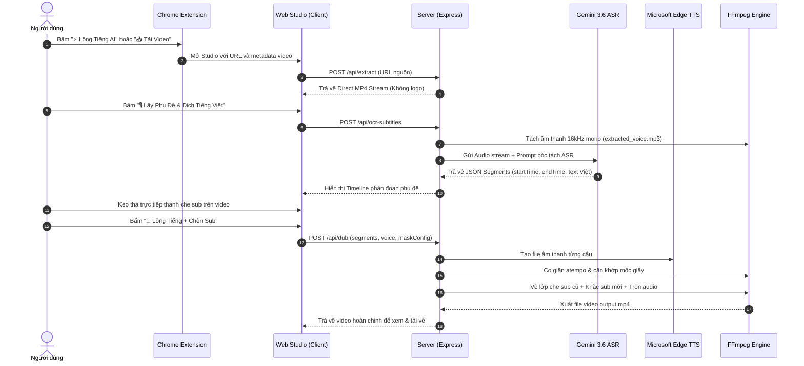

# 📐 Tài Liệu Kiến Trúc Hệ Thống DUZKVIDEOTOOL

Tài liệu này mô tả chi tiết kiến trúc kỹ thuật, thiết kế module và luồng xử lý dữ liệu của nền tảng **DUZKVIDEOTOOL**.

---

## 1. Tổng Quan Kiến Trúc (System Architecture)

DUZKVIDEOTOOL bao gồm 3 tầng kiến trúc chính:

1. **Client Extension Layer (Chrome MV3):**
   - Tiện ích mở rộng quét DOM, trích xuất metadata và chèn các nút thao tác nhanh (Floating Action Toolbars) trên các trang Douyin, Bilibili, Xiaohongshu.
   - Giao diện Sidepanel cho phép quản lý và tải hàng loạt video.

2. **Web Studio Layer (React 19 + Vite):**
   - Giao diện chỉnh sửa trực quan với Canvas tương tác trực tiếp trên video (`Interactive On-Video Studio`).
   - Quản lý timeline phụ đề, nghe thử giọng đọc AI và điều chỉnh vị trí lớp che phụ đề gốc.

3. **Backend Service & Processing Engine (Node.js + FFmpeg):**
   - Module bóc tách liên kết không logo (`extractor.js`).
   - Module xử lý phụ đề ASR & Vision OCR (`ocrService.js`).
   - Module tổng hợp giọng đọc Neural TTS khớp thời gian (`edgeTts.js`).
   - Engine trộn video đa kênh, vẽ bounding box che sub và render phụ đề (`ffmpegService.js`).

---

## 2. Luồng Xử Lý Dữ Liệu Chi Tiết (Data Flow)

---

## 3. Các Giải Pháp Kỹ Thuật Đột Phá

### 3.1. Vượt Tường Lửa & Chống Lỗi 403 Forbidden (`getRefererForUrl`)
Hệ thống sử dụng cơ chế phát hiện tự động nguồn CDN để gửi đúng header `Referer` và `User-Agent`:
- `bilibili.com`, `akamaized.net`, `bilivideo.com` $\rightarrow$ `Referer: https://www.bilibili.com/`
- `xiaohongshu.com`, `xhscdn.com` $\rightarrow$ `Referer: https://www.xiaohongshu.com/`
- `douyin.com`, `zjcdn.com` $\rightarrow$ `Referer: https://www.douyin.com/`

### 3.2. Thuật Toán Đồng Bộ Nhịp Giọng Đọc (`Time-Aligned Dubbing Engine`)
- So sánh thời lượng thực tế của câu tiếng Việt phát âm ra (`ttsDuration`) với thời lượng câu gốc trong video (`targetDuration`).
- Tự động áp dụng bộ lọc `atempo` (tăng tốc tối đa 1.35x) hoặc chèn `silence padding` để câu nói tiếng Việt dứt điểm chính xác cùng lúc với nhân vật gốc.
